# AA5-Wireshark

## ICMP

Kali ja té instal·lat Wireshark. Si esteu utilitzant un Ubuntu Desktop, instal·la i configura Wireshark.

Posa en marxa la captura de paquets de Wireshark sobre la targeta de xarxa del teu Kali amb adaptador pont:

- Adreça IP: 192.168.2.12/24 
- Porta d'enllaç: 192.168.2.254
- DNS: 8.8.8.8

---

Obre una consola i executa un ping a algun servei o al router de l'escola. Deixa que faci quatre o cinc peticions i atura la comanda (el ping per defecte a Linux no para d'enviar paquets).

> **NOTA:** No facis un ping a la teva pròpia màquina perquè els paquets realment no surten de la teva màquina i el Wireshark no els pot capturar.

Atura la captura de paquets. Veuràs que s'ha capturat un munt de paquets, sense discriminar, però només volem veure els que fan referència al ping que hem fet.

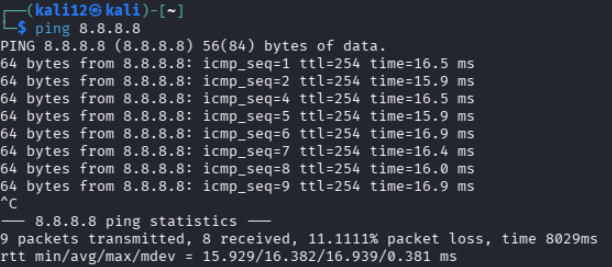

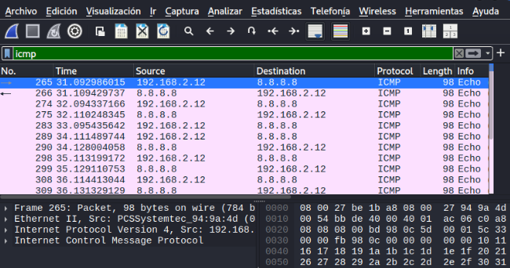

Quin número de tipus de ICMP té la petició d'eco i quin la resposta d'eco? Com ho veus?.Incorpoar una captura de pantalla on es vegi el tipus de ICMP.

Echo request (petició): tipus 8

Echo reply (resposta): tipus 0

Com es veu al Wireshark?
Quan apliques el filtre icmp, selecciones un paquet i obres el detall del protocol ICMP, apareix el camp Type.

## MODE PROMISCU ACTIVAT

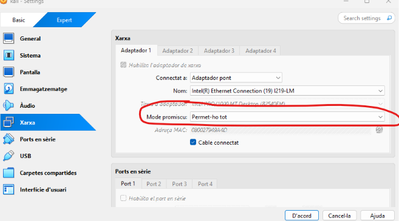

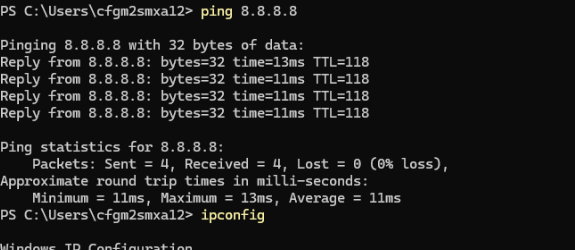

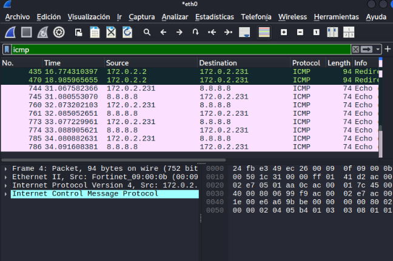

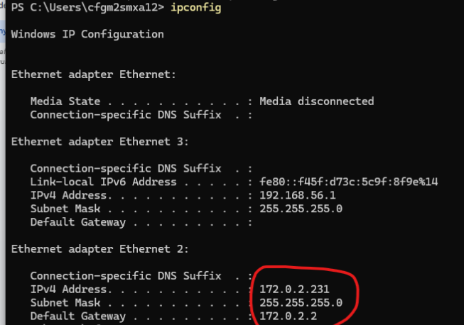

Fes una captura de trànsit, mentre navegues des de la màquina física. Quin trànsit pots veure relacionat amb el teu PC?

Quan navegues des del Windows (IP 172.0.2.231, gateway 172.0.2.2), el Wireshark captura tot el trànsit que veu la interfície en mode promiscu. Pots veure:

Peticions DNS del Windows a 172.0.2.2 o a 8.8.8.8 (si el té configurat).

Trànsit HTTP/HTTPS cap a servidors web.

Paquets ARP demanant qui té la IP del gateway.

Trànsit ICMP si fas ping des del Windows.

Trànsit de protocols de xarxa com TCP, UDP, etc.

---

## DNS

Centreu l'atenció en el protocol DNS posant un filtre de visualització (protocol DNS i adreça IP d'origen o destí la de la nostra màquina). Veieu la petició de resolució que fa el vostre client?

Comproveu que la resposta del servidor conté l'adreça IP de www.xtec.cat (comproveu amb la comanda nslookup quina és).

Sí, es veu clarament.
A la meva captura, amb el filtre dns and ip.addr == 192.168.2.12 (o l’adreça del teu Kali), apareixen peticions a 8.8.8.8.

La comanda nslookup www.xtec.cat retorna:
Address: 83.247.151.214

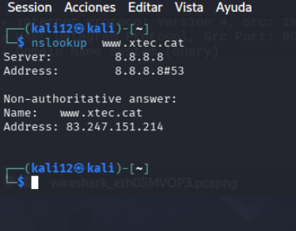

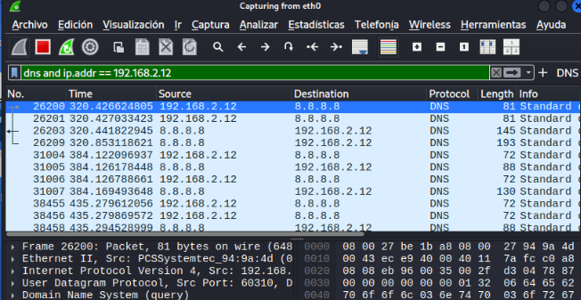

---

## ARP

Ara mirarem el protocol ARP, que serveix als nostres equips per demanar per broadcast qui te una adreça IP determinada i obtenir la seva adreça MAC.

Quina adreça MAC té el gateway de la xarxa? Quin és el fabricant de la seva NIC?

Gateway IP: 192.168.2.254 (i també apareix 192.168.2.1 com a ruta alternativa)

A la captura ARP es veu un paquet Who has 192.168.2.254? i la resposta prové de Fortinet_09:00:0b.

Adreça MAC: Fortinet_09:00:0b (caldrà veure’n el detall complet, p. ex., xx:xx:xx:09:00:0b)

El prefix OUI Fortinet pertany a Fortinet, Inc. (fabricant de firewalls i equips de xarxa)

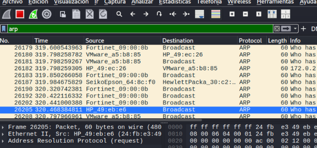

---

## Anàlisi de captura. Arxius

1.Al protocol ARP: Pots saber quina adreça MAC té l'equip amb adreça 192.168.1.1? Fes un filtre per a veure només els paquets d'aquesta adreça del protocol ARP.

Adreça MAC de 192.168.1.1: d4:76:ea:0f:fd:58
Fabricant: ZTE (per l’OUI d4:76:ea)

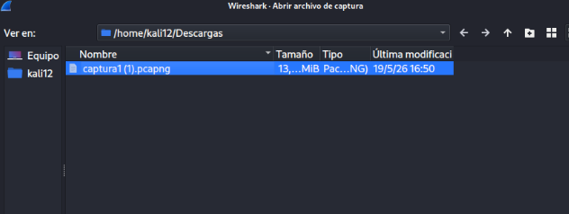

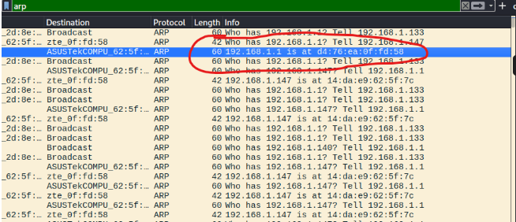

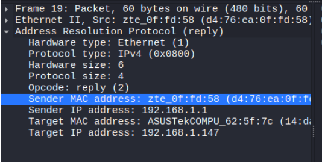

---

2.A la sessió FTP:

Quin és el password de l'usuari que inicia sessió? Quin nom té el fitxer que es descarrega del servidor?

USER anonymous
PASS contra
...
RETR README.txt

que seria 
Password: contra
Fitxer descarregat: README.txt

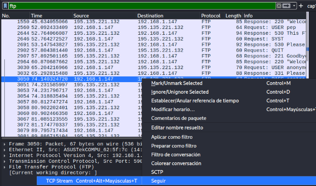

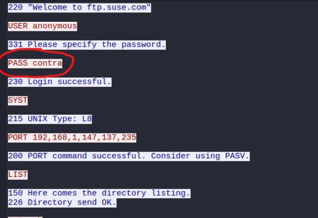

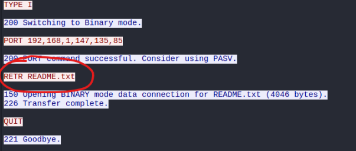

---

3.A la sessió de Telnet:

Pots veure el que veia l'usuari en connectar al telnet? Explica què és. Quins caràcters composen la nau espacial petita (posar com a resposta)?

Si segueixes el flux TCP (Follow → TCP Stream), veuràs la sortida del servidor Telnet. Normalment és un menú, un joc, o una animació ASCII.
A les captures apareix referència a una nau espacial petita.

I de caracters podem trobar <|>  ^^  >==<>

A quin domini pertany l'adreça on ens connectem?

L’adreça IP del servidor Telnet és 94.142.241.111.
Si fas nslookup 94.142.241.111 (o consultes el trànsit DNS previ), pots obtenir el domini. A la teva captura el DNS time-out, però podria ser un domini com telehack.com o similar.

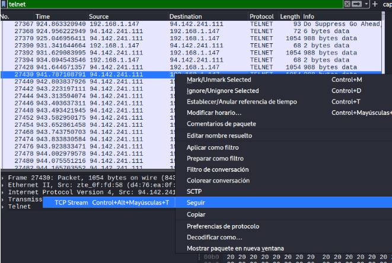

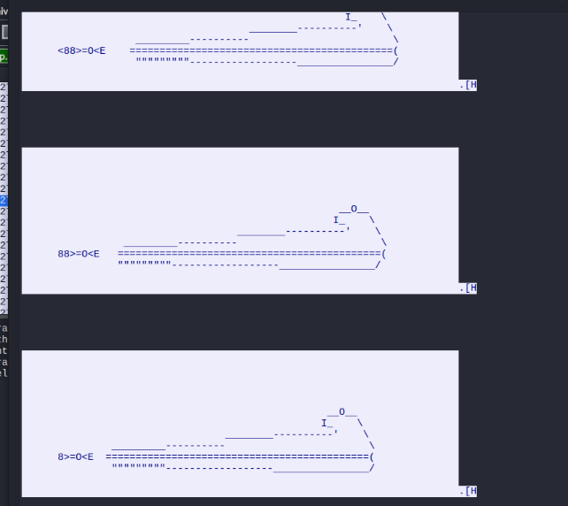

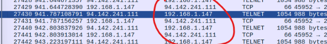

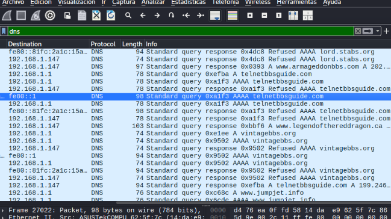

---

4.A la sessió SSH:

Pots saber a quin domini pertany l'adreça del servidor?

IP del servidor SSH: 205.166.94.17

Pots veure el contingut de les dades de la sessió? Enganxa les dades que conté el paquet ssh de longitud total 326 bytes.

El paquet és xifrat (SSHv2 amb chacha20-poly1305).
Les dades que es veuen són:

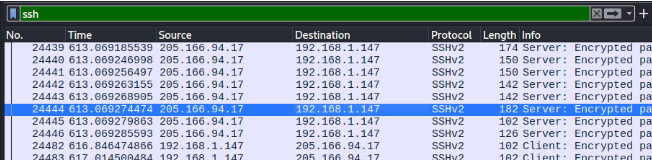

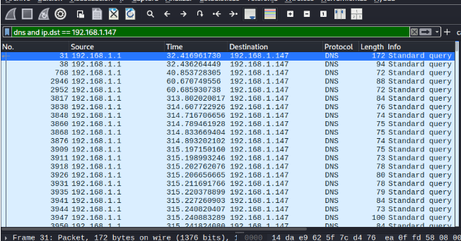

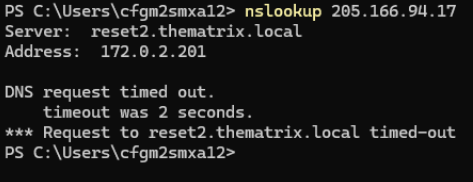

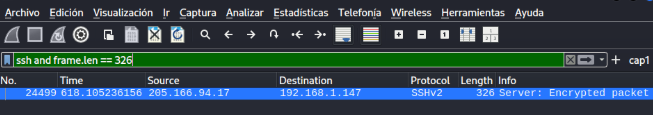

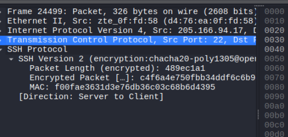

---

5.Correu electrònic:

Ara carrega l'arxiu "captura2.pcapng" que també teniu al repositori, troba el missatge que s’ha enviat amb el protocol de correu sortint. Extreu el fitxer.

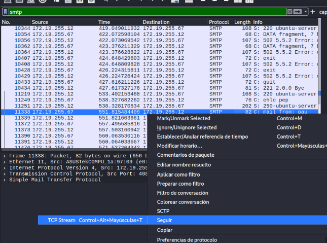

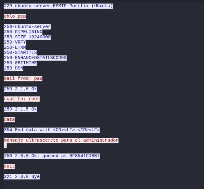

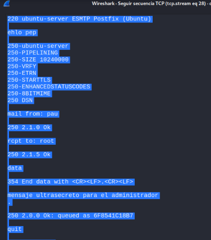

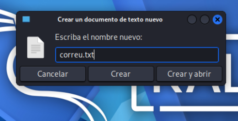

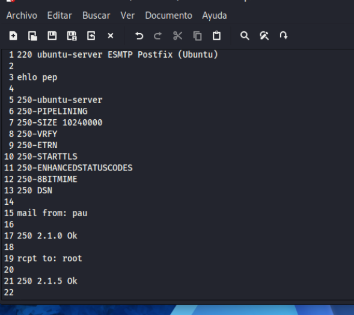

----------------
