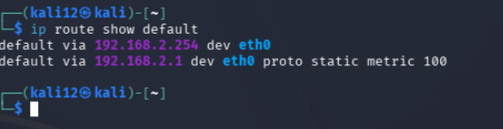
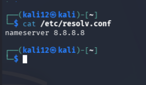
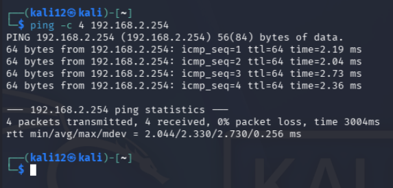
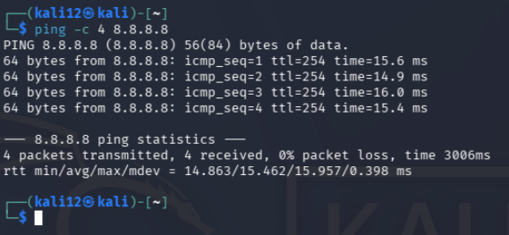
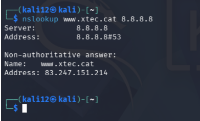
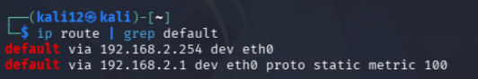

# AA5-Wireshark

## ICMP

Kali ja té instal·lat Wireshark. Si esteu utilitzant un Ubuntu Desktop, instal·la i configura Wireshark.

Posa en marxa la captura de paquets de Wireshark sobre la targeta de xarxa del teu Kali amb adaptador pont:

- Adreça IP: 192.168.2.12/24 
- Porta d'enllaç: 192.168.2.254
- DNS: 8.8.8.8

---

Obre una consola i executa un ping a algun servei o al router de l'escola. Deixa que faci quatre o cinc peticions i atura la comanda (el ping per defecte a Linux no para d'enviar paquets).

> **NOTA:** No facis un ping a la teva pròpia màquina perquè els paquets realment no surten de la teva màquina i el Wireshark no els pot capturar.

Atura la captura de paquets. Veuràs que s'ha capturat un munt de paquets, sense discriminar, però només volem veure els que fan referència al ping que hem fet.

## MODE PROMISCU ACTIVAT

Quin número de tipus de ICMP té la petició d'eco i quin la resposta d'eco? Com ho veus?.Incorpoar una captura de pantalla on es vegi el tipus de ICMP.

Fes una captura de trànsit, mentre navegues des de la màquina física. Quin trànsit pots veure relacionat amb el teu PC?

---

## DNS

Centreu l'atenció en el protocol DNS posant un filtre de visualització (protocol DNS i adreça IP d'origen o destí la de la nostra màquina). Veieu la petició de resolució que fa el vostre client?

Comproveu que la resposta del servidor conté l'adreça IP de www.xtec.cat (comproveu amb la comanda nslookup quina és).

---

## ARP

Ara mirarem el protocol ARP, que serveix als nostres equips per demanar per broadcast qui te una adreça IP determinada i obtenir la seva adreça MAC.

Quina adreça MAC té el gateway de la xarxa? Quin és el fabricant de la seva NIC?

---

## Anàlisi de captura. Arxius

1.Al protocol ARP: Pots saber quina adreça MAC té l'equip amb adreça 192.168.1.1? Fes un filtre per a veure només els paquets d'aquesta adreça del protocol ARP.

---

2.A la sessió FTP:

Quin és el password de l'usuari que inicia sessió? Quin nom té el fitxer que es descarrega del servidor?

---

3.A la sessió de Telnet:

Pots veure el que veia l'usuari en connectar al telnet? Explica què és. Quins caràcters composen la nau espacial petita (posar com a resposta)?
A quin domini pertany l'adreça on ens connectem?

---

4.A la sessió SSH:

Pots saber a quin domini pertany l'adreça del servidor?
Pots veure el contingut de les dades de la sessió? Enganxa les dades que conté el paquet ssh de longitud total 326 bytes.

---

5.Correu electrònic:

Ara carrega l'arxiu "captura2.pcapng" que també teniu al repositori, troba el missatge que s’ha enviat amb el protocol de correu sortint. Extreu el fitxer.

----------------
